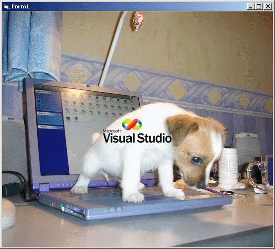



## Draw Picture Transparently On Another Picture

### Description

This demonstrates simply how to draw a bitmap/gif using a mask color (such as rgb(255,0,255)) as the transparent color and placing it on top of another image (or form DC).
 
### More Info
 

             |
---                |---
**Submitted On**   |2007-04-22 00:40:18
**By**             |[Jason Newland](https://github.com/Planet-Source-Code/PSCIndex/blob/master/ByAuthor/jason-newland.md)
**Level**          |Intermediate
**User Rating**    |5.0 (10 globes from 2 users)
**Compatibility**  |VB 6\.0
**Category**       |[Graphics](https://github.com/Planet-Source-Code/PSCIndex/blob/master/ByCategory/graphics__1-46.md)
**World**          |[Visual Basic](https://github.com/Planet-Source-Code/PSCIndex/blob/master/ByWorld/visual-basic.md)
**Archive File**   |[Draw\_Pictu2061574222007\.zip](https://github.com/Planet-Source-Code/jason-newland-draw-picture-transparently-on-another-picture__1-68411/archive/master.zip)

